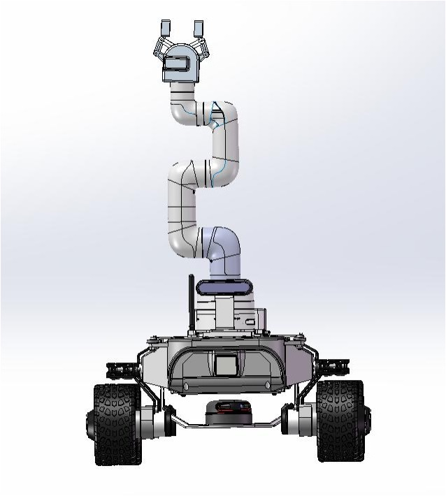
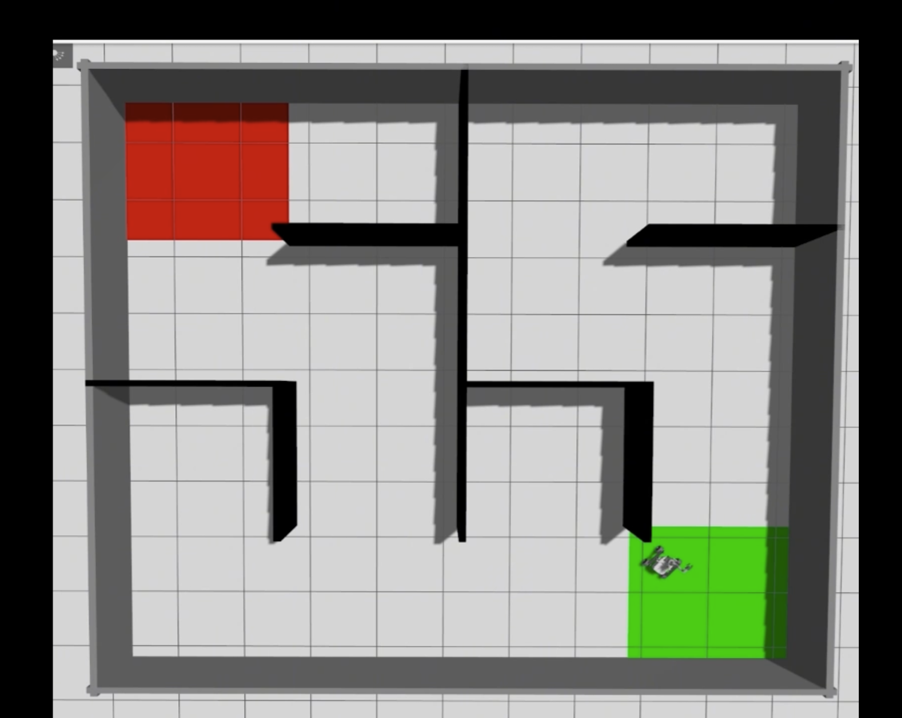
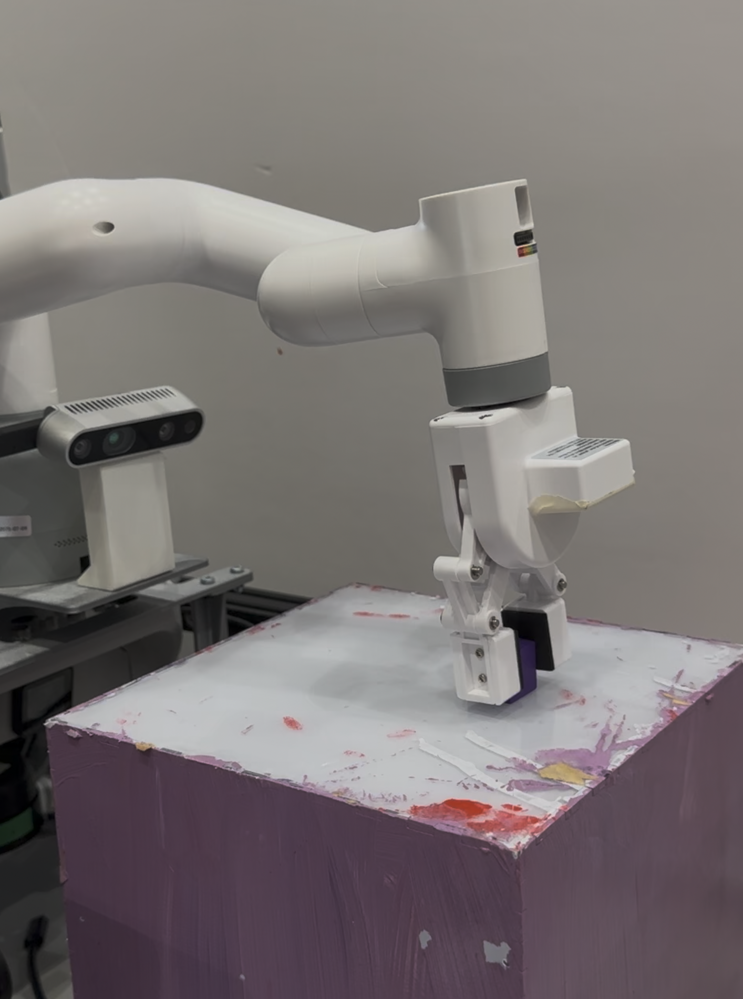
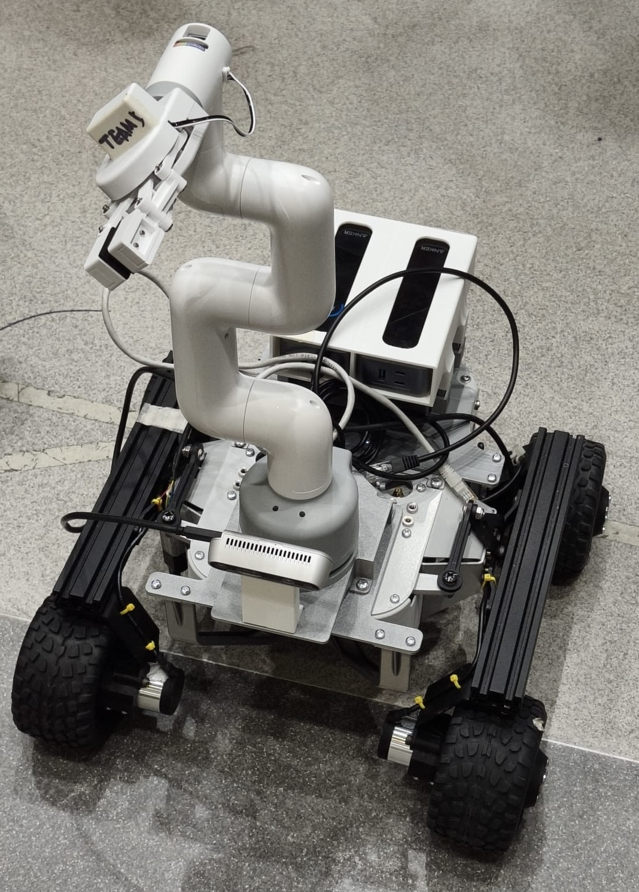

# Leo Rover Autonomous Mission - Group Project

Group ROS2 mobile manipulation project using a Leo Rover platform, RGB-D perception, object detection, Nav2 navigation, manipulator control, custom ROS2 interfaces and a finite-state mission controller.

## Overview

This repository contains the ROS2 source packages used for the high-level mission control, perception interface, navigation wrapper and manipulator control of an autonomous Leo Rover mobile manipulation system.

The robot was designed to search for coloured objects and matching coloured bins, navigate through an indoor test environment, approach target objects, command a myCobot manipulator to grasp them, navigate to the matching bin and place them.

This was a group robotics systems project. My main contributions were assembling and integrating the rover platform, developing the vision system and camera setup, training the object-detection model, working on manipulator control, and supporting Nav2 navigation and full system integration.

## Project Media

### CAD Platform Design

### Simulation Environment

### Manipulator and RGB-D Camera Test

### Assembled Rover Platform

## Mission Objective

The robot mission was designed around an autonomous pick-and-place workflow:

- Search the environment for coloured objects and matching coloured bins
- Detect objects and bins using the RGB-D vision system
- Store detected target positions using colour-based semantic memory
- Select an object-bin pair with matching colour
- Send navigation goals for object approach and bin approach
- Command the manipulator to grasp and place the object
- Use perception and navigation feedback to progress through the mission
- Repeat the process for remaining object-bin pairs

## My Contributions

My main contributions included:

- Assembled and integrated the Leo Rover platform with the manipulator, RGB-D camera and supporting hardware
- Developed the vision system setup using the Intel RealSense RGB-D camera
- Trained and tested the YOLO object-detection model for coloured object and bin detection
- Worked on manipulator control for grasping and placement actions
- Supported Nav2 navigation testing and system behaviour tuning
- Helped debug full-system integration across perception, navigation, manipulation and ROS2 communication

## Repository Scope

This repository focuses on the ROS2 mission-control and subsystem-interface code.

It includes:

- Finite-state mission controller
- RGB-D camera and YOLO detection node
- Nav2 goal-handling wrapper node
- myCobot manipulator control node
- Custom ROS2 message interfaces
- Launch file for the integrated control system
- TF simulation/testing helper node

The wider physical system also used LiDAR SLAM, Nav2, the Leo Rover base controller, onboard compute and external power hardware. Those full subsystem configurations are documented in the project report, while this repository mainly contains the mission-level ROS2 control package and related nodes.

## Key Features

- ROS2 finite-state mission controller for autonomous task coordination
- Custom ROS2 message interfaces for object targets, camera-to-arm poses, gripper states and status feedback
- YOLO + RealSense perception node for detecting coloured objects and bins
- Depth-based 3D target estimation from RGB-D camera data
- Colour-based semantic memory for matching objects with bins
- Nav2 wrapper node for exploration commands and target goal execution
- 0.25 m standoff goal calculation for object/bin approach
- myCobot manipulator node for arm pose commands and gripper control
- Grasp retry and target deferral logic to reduce mission deadlock
- Launch file for starting the main control, camera, navigation and manipulator nodes together

## Hardware Platform

- Leo Rover mobile base
- myCobot 280 Pi manipulator and gripper
- Intel RealSense D435 RGB-D camera
- RPLIDAR sensor
- ASUS NUC onboard computer
- Raspberry Pi controllers
- External power banks
- Custom mounts and platform integration hardware

## Software and Tools

- ROS2
- Python
- CMake
- Custom ROS2 messages
- TF2 coordinate transforms
- Intel RealSense SDK / pyrealsense2
- OpenCV
- YOLO / Ultralytics
- Nav2 NavigateToPose action interface
- pymycobot
- Linux / Ubuntu
- Git

## Repository Structure

    leo-rover-mission/
    ├── src/
    │   ├── my_robot_interfaces/
    │   │   └── msg/
    │   │       ├── CamArmPose.msg
    │   │       ├── ErrorStatus.msg
    │   │       ├── GripperPose.msg
    │   │       ├── GripperState.msg
    │   │       └── ObjectTarget.msg
    │   └── robot_control_system/
    │       ├── README.md
    │       ├── launch/
    │       │   └── system_control.launch.py
    │       └── robot_control_system/
    │           ├── camera_node.py
    │           ├── manipulator_node.py
    │           ├── nav_node.py
    │           ├── robot_fsm.py
    │           └── tf_sim_node.py
    ├── media/
    │   ├── cad-platform-design.jpg
    │   ├── simulation-environment.jpg
    │   ├── manipulator-test.jpg
    │   └── assembled-rover.jpg
    ├── README.md
    └── LICENSE

## System Architecture

    Intel RealSense RGB-D Camera
              ↓
    camera_node.py
    YOLO detection + depth-based 3D target estimation
              ↓
    /detected_object + /detection_state
              ↓
    robot_fsm.py
    Finite-state mission controller + semantic object/bin memory
              ↓
    ┌───────────────────────────────┬───────────────────────────────┐
    ↓                               ↓
    nav_node.py                     manipulator_node.py
    Nav2 goal wrapper               myCobot arm/gripper interface
    ↓                               ↓
    /nav/goal_reached               arm motion + gripper commands
              ↓
    Mission state transitions and task completion

## ROS2 Package Summary

### my_robot_interfaces

Defines the custom ROS2 messages used for communication between the mission controller, camera node, navigation node and manipulator node.

Main message types include:

- ObjectTarget: object/bin label, colour and 3D target position
- CamArmPose: camera-frame target pose for manipulation
- GripperState: gripper open/close or arm-state command
- GripperPose: gripper pose information
- ErrorStatus: status/error reporting

### robot_control_system

Contains the ROS2 nodes used for mission coordination and subsystem communication.

Main files include:

- robot_fsm.py: finite-state mission controller
- camera_node.py: RealSense + YOLO perception node
- nav_node.py: Nav2 NavigateToPose wrapper node
- manipulator_node.py: myCobot arm and gripper control node
- tf_sim_node.py: TF simulation/testing helper node
- system_control.launch.py: launch file for starting the control system

For more detailed control-node documentation, see:

    src/robot_control_system/README.md

## Mission Controller

The mission controller is implemented as a finite-state machine in robot_fsm.py.

Main states:

- INIT: wait for camera, navigation and manipulator interfaces to become available
- SEARCH: collect object and bin detections while exploration is active
- MOVE_TO_OBJECT: send the selected object position as a navigation goal
- GRASP: send the latest camera-frame object pose to the manipulator and command the gripper
- MOVE_TO_BOX: send the matching bin position as a navigation goal
- DROP: command object placement and mark the pair as solved

The controller uses asynchronous ROS2 callbacks and topic feedback to avoid blocking the full mission while waiting for perception, navigation or arm actions.

## Perception Node

The camera node uses an Intel RealSense RGB-D camera and a YOLO model to detect coloured objects and bins.

The node:

- Captures aligned colour and depth frames
- Runs YOLO detection on camera frames
- Classifies detections as object or box
- Extracts colour labels such as red, yellow or purple
- Estimates 3D target position using depth data
- Publishes ObjectTarget messages on /detected_object
- Publishes detection heartbeat/status on /detection_state

## Navigation Wrapper

The navigation node acts as the interface between the mission controller and Nav2.

The node:

- Subscribes to /nav/cmd_explore to enable or stop exploration behaviour
- Subscribes to /nav/goal_point for target positions from the FSM
- Uses the Nav2 NavigateToPose action interface
- Calculates a standoff position before sending a goal
- Publishes /nav/goal_reached when a target navigation task succeeds

This keeps mission logic separate from low-level navigation execution.

## Manipulator Control

The manipulator node controls the myCobot arm and gripper using pymycobot.

The node:

- Subscribes to /arm/grasp_pose for camera-frame target positions
- Subscribes to /arm/grasp_status for gripper open/close commands
- Subscribes to /arm/initial_position to return the arm to a safe pose
- Converts camera-frame target values into arm command coordinates
- Sends coordinates and gripper commands to the myCobot controller

## Semantic Object-Bin Memory

The mission controller stores detections using a colour-based memory structure.

For each colour, the system can store:

- object camera-frame pose
- object map-frame pose
- bin camera-frame pose
- bin map-frame pose
- task status

When both an object and bin of the same colour are available, the target pair becomes eligible for mission execution.

## Grasp and Drop Verification

After a grasp attempt, the mission controller checks whether the target object remains visible in the perception stream.

If the object is no longer detected, the grasp is treated as successful and the robot continues to the matching bin. If the object remains visible, the grasp can be retried. After repeated failures, the target can be deferred so the mission can continue rather than becoming blocked.

## Build and Run

Create a ROS2 workspace:

    mkdir -p ~/leo_rover_ws/src
    cd ~/leo_rover_ws/src

Clone the repository:

    git clone https://github.com/musa-z/leo-rover-mission.git

Build the workspace:

    cd ~/leo_rover_ws
    colcon build
    source install/setup.bash

Launch the integrated control system:

    ros2 launch robot_control_system system_control.launch.py

Run individual nodes if needed:

    ros2 run robot_control_system robot_fsm
    ros2 run robot_control_system camera_node
    ros2 run robot_control_system nav_node
    ros2 run robot_control_system manipulator_node

## Limitations and Future Improvements

Performance depends on object detection reliability, camera calibration, depth accuracy, TF accuracy, Nav2 feedback, manipulator reach and consistent ROS2 communication between nodes.

Future improvements would include improving recovery behaviour after failed navigation or manipulation, refining grasp verification, adding automated tests for finite-state transitions, improving mission logging and integrating richer diagnostic feedback from the rover and manipulator.
